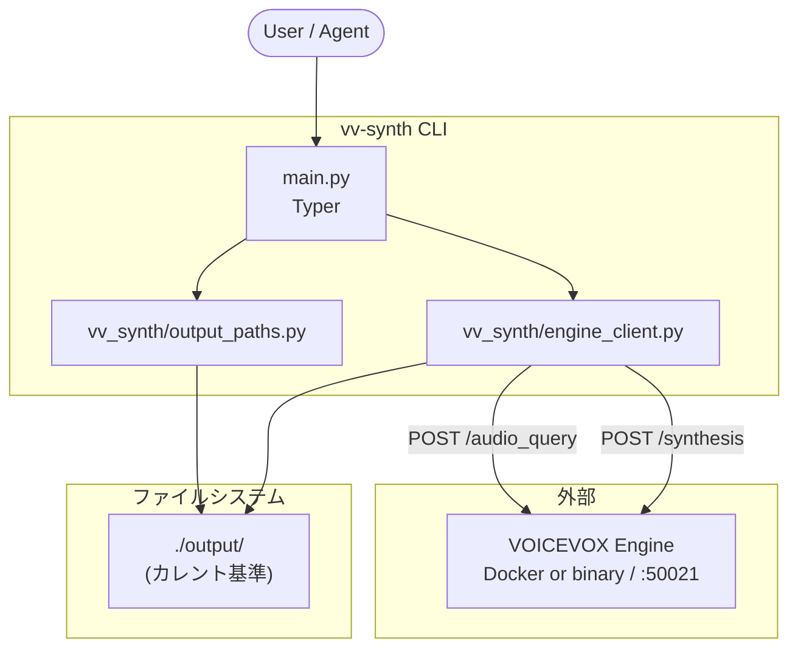
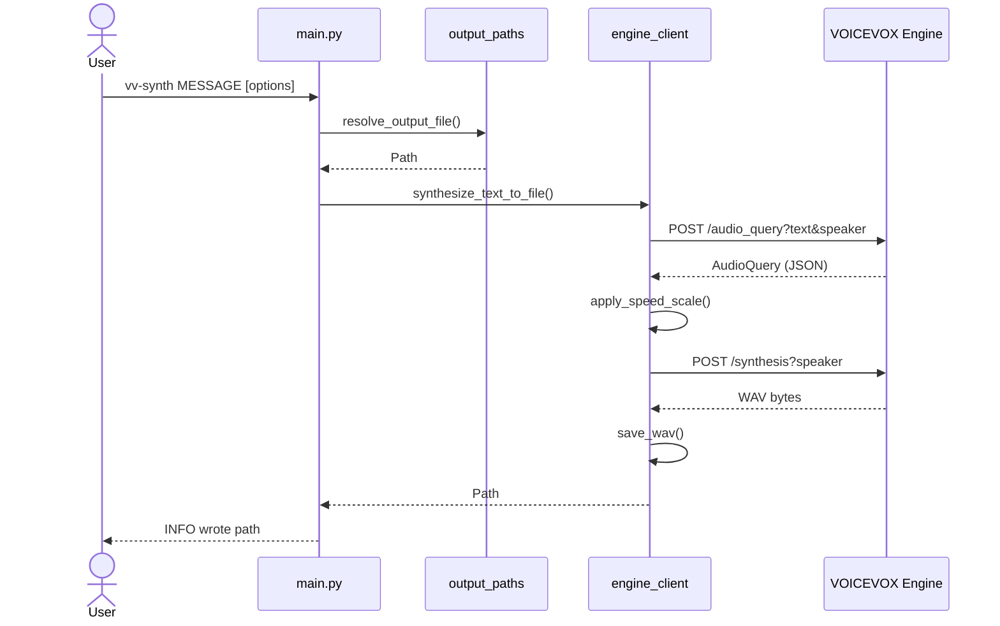

# vv-synth

[English](README.md)

[VOICEVOX](https://voicevox.hiroshiba.jp/) Engine でテキストを WAV に合成する CLI です。

このファイルは日本語版 README です。メインの README は英語版 [`README.md`](README.md) です。

`vv-synth` に読み上げテキストを渡すと、合成した WAV を保存します。

- **メイン README:** [English](README.md)
- **利用者向け:** [クイックスタート](#クイックスタート) / [使い方](#使い方)
- **メンテナ向け:** [アーキテクチャ](#アーキテクチャ) / [メンテナンス手順](#メンテナンス手順)
- **OSS 公開・規約:** [OSS 公開と VOICEVOX 利用規約](#oss-公開と-voicevox-利用規約)
- **AI エージェント向け（開発推奨: Codex CLI / Claude Code）:** [`AGENTS.md`](AGENTS.md) / [`CLAUDE.md`](CLAUDE.md) / [`.claude/rules/`](.claude/rules/) / [`skills/README.md`](skills/README.md)（`gh skill` / `npx skills` で Cursor・Claude Code・Codex 等へ）
- **Agent Skills:** [`skills/vv-synth/`](skills/vv-synth/)（任意プロジェクト向け TTS）、[`skills/vv-synth-dev/`](skills/vv-synth-dev/)（本リポ開発）

## 必要なもの

| 項目 | 用途 |
|------|------|
| Python 3.14+ | 実行環境 |
| [uv](https://docs.astral.sh/uv/) | 依存関係管理 |
| [Docker](https://www.docker.com/) | VOICEVOX Engine をコンテナで起動する場合 |
| VOICEVOX Engine (起動済み) | HTTP API (`http://127.0.0.1:50021`) — Docker または公式バイナリで用意 |

Windows でも `vv-synth` は使えます。`vv-synth` 本体は VOICEVOX Engine に HTTP で接続するだけなので、Python 3.14+ / uv と `http://127.0.0.1:50021` で応答する Engine があれば、合成手順は macOS / Linux と同じです。Windows で GPU 版を使う場合は、下記の [Windows + NVIDIA GPU](#windows--nvidia-gpu-docker-desktop) を参照してください。

VOICEVOX CORE (`voicevox_core/`) は `vv-synth` では不要です。

## OSS 公開と VOICEVOX 利用規約

`vv-synth` は MIT ライセンスの OSS で、このリポジトリに含まれるのは VOICEVOX Engine に HTTP で接続する小さな CLI だけです。VOICEVOX Engine 本体、音声ライブラリ、モデル、Docker image、Windows / macOS / Linux 向けバイナリ、生成された WAV はこのリポジトリに同梱しません。

VOICEVOX Engine と音声ライブラリを利用するときは、利用者が最新の公式規約を確認し、遵守してください。生成音声の利用には、VOICEVOX のクレジット表記と各音声ライブラリ / 話者ごとの利用規約が関係します。アプリケーションや配布物に音声を組み込む場合も、最終的な配布先で規約とクレジット要件を満たすようにしてください。

参考:

- [VOICEVOX 公式利用規約](https://voicevox.hiroshiba.jp/term/)
- [voicevox/voicevox_engine on Docker Hub](https://hub.docker.com/r/voicevox/voicevox_engine)
- [VOICEVOX Engine Releases](https://github.com/VOICEVOX/voicevox_engine/releases)
- [VOICEVOX Q&A](https://voicevox.hiroshiba.jp/qa/)

メンテナ向けチェック（変更・リリースのたびに）:

- `LICENSE`（MIT）と `pyproject.toml` のライセンス表記が一致していることを確認する
- README の VOICEVOX 公式リンクが最新であることを確認する
- VOICEVOX Engine / 音声ライブラリ / モデル / 生成 WAV が Git に含まれていないことを確認する
- サンプル音声を配布する場合は、話者ごとの規約とクレジット表記を確認する

## VOICEVOX Engine の用意

`vv-synth` が使うのは **HTTP で応答する Engine だけ** です。GUI の VOICEVOX デスクトップアプリは不要です。  
Docker を使う場合は **公式イメージ** で Engine を起動します。Docker を使わない場合は、[バイナリで用意する場合](#バイナリで用意する場合) を参照してください。

出典: [voicevox/voicevox_engine on Docker Hub](https://hub.docker.com/r/voicevox/voicevox_engine)、[Docker Desktop GPU support](https://docs.docker.com/desktop/features/gpu/)、[VOICEVOX Q&A](https://voicevox.hiroshiba.jp/qa/)

### 1. イメージの取得（初回のみ）

```shell
docker pull voicevox/voicevox_engine:cpu-latest
```

Apple Silicon / Intel Mac とも CPU 版で問題ないことが多いです。Windows / Linux の NVIDIA GPU 環境では `nvidia-latest` タグを使えます（Docker Hub 参照）。

### 2. Engine を起動する

**推奨コマンド**（フォアグラウンド。ログが見え、停止は `Ctrl+C`）:

```shell
docker run --rm -it -p '127.0.0.1:50021:50021' voicevox/voicevox_engine:cpu-latest
```

- `--rm` … 停止時にコンテナを削除
- `-p '127.0.0.1:50021:50021'` … ホストの localhost:50021 をコンテナに転送（`vv-synth` の既定 URL と一致）
- このターミナルは Engine 起動中は占有されます。合成は **別ターミナル** で `vv-synth` を実行します。

**バックグラウンド起動**（開発で Engine を裏に置きたいとき）:

```shell
docker run --rm -d -p '127.0.0.1:50021:50021' voicevox/voicevox_engine:cpu-latest
```

停止例: `docker ps` で CONTAINER ID を確認し `docker stop <id>`。

### Windows + NVIDIA GPU (Docker Desktop)

Windows で Docker の GPU 版 Engine を使う場合は、Docker Desktop の WSL2 backend と NVIDIA GPU が必要です。事前に次を確認してください。

- Windows 10 / 11 + NVIDIA GPU
- WSL2 backend を有効にした Docker Desktop
- WSL2 GPU に対応した最新の NVIDIA ドライバー
- 最新の WSL2 Linux kernel（PowerShell で `wsl --update`）

GPU が Docker から見えているか確認:

```shell
docker run --rm -it --gpus=all nvcr.io/nvidia/k8s/cuda-sample:nbody nbody -gpu -benchmark
```

VOICEVOX Engine GPU 版を起動:

```shell
docker pull voicevox/voicevox_engine:nvidia-latest
docker run --rm -it --gpus all -p '127.0.0.1:50021:50021' voicevox/voicevox_engine:nvidia-latest
```

バックグラウンドで起動する場合:

```shell
docker run --rm -d --gpus all -p '127.0.0.1:50021:50021' voicevox/voicevox_engine:nvidia-latest
```

以降の `curl` と `vv-synth` の使い方は CPU 版と同じです。GPU を使っているかどうかは Engine 側の問題で、`vv-synth` に追加オプションは不要です。

### 3. 起動確認

Engine 起動中に、別ターミナルで:

```shell
curl -sSf http://127.0.0.1:50021/version
```

JSON が返れば OK。話者 ID は [http://127.0.0.1:50021/docs](http://127.0.0.1:50021/docs) の `/speakers`。

### 4. `vv-synth` で合成する

```shell
vv-synth "こんにちは、VOICEVOX Engine のテストです。"
```

成功するとカレントディレクトリの `output/YYYYMMDD-HHMMSS.wav` (ローカル時刻) ができます。`output/` ディレクトリは初回実行時に自動作成されます。

### トラブルシュート（Docker）

| 症状 | 対処 |
|------|------|
| `Cannot connect to the Docker daemon` | Docker Desktop を起動 |
| `port is already allocated` (50021) | 既存の Engine コンテナまたはデスクトップ VOICEVOX を停止 |
| `could not select device driver` / GPU が見えない | Docker Desktop が WSL2 backend か、NVIDIA ドライバーと `wsl --update` を確認 |
| `vv-synth` が接続できない | コンテナが動いているか `curl .../version`、ポートが `127.0.0.1:50021` か確認 |
| 話者 ID エラー (HTTP 4xx) | `/docs` の `/speakers` で `--speaker` を合わせる |

**注意:** デスクトップ VOICEVOX アプリもポート 50021 を使います。別の Engine と **同時に起動しない** でください。

### バイナリで用意する場合

Docker を使わない場合は、[VOICEVOX Engine Releases](https://github.com/VOICEVOX/voicevox_engine/releases) から利用環境に合う公式バイナリを取得して Engine を起動してください。Windows では CPU 版、GPU/DirectML 版、GPU/CUDA 版が配布されています。

起動後に `http://127.0.0.1:50021/version` が応答すれば、`vv-synth` からは Docker 版と同じように利用できます。ポートを変えた場合は `--engine-url` または `VOICEVOX_ENGINE_URL` を指定してください。

## クイックスタート

```shell
uv sync
uv run vv-synth --help
```

[Docker または公式バイナリで Engine を起動](#voicevox-engine-の用意) したあと（別ターミナルで）:

```shell
vv-synth "こんにちは、音声合成のテストです。"
```

`vv-synth` が PATH にない場合は [グローバルインストール](#グローバルインストール) を行うか、プロジェクト内では `uv run vv-synth` を使います。

成功すると、実行したディレクトリの `output/YYYYMMDD-HHMMSS.wav` (ローカル時刻) が作成されます。`output/` ディレクトリは初回実行時に自動作成されます。既定の保存先を変えたい場合は `VV_SYNTH_OUTPUT_DIR` 環境変数で指定できます。

## グローバルインストール

```shell
uv tool install --editable .
```

インストール後は以下の2つのコマンドが利用できます（動作は同一です）:

- `vv-synth` — 正式名
- `vvs` — 短縮エイリアス

`~/.local/bin` が PATH にない場合:

```shell
uv tool update-shell
# または
export PATH="$HOME/.local/bin:$PATH"
```

アンインストール:

```shell
uv tool uninstall vv-synth
```

リポジトリの場所を移動した場合は、再インストールします:

```shell
uv tool uninstall vv-synth
cd /path/to/vv-synth
uv tool install --editable .
```

## Agent Skill のローカルインストール

移植用の `vv-synth` Agent Skill を入れると、コーディングエージェントがほかのプロジェクトからこの CLI を使えるようになります。インストールには `gh skill` を推奨します。`npx skills`（Vercel Labs）も使えます。

### 推奨: `gh skill`

GitHub CLI v2.90 以降が必要です:

```shell
cd /path/to/vv-synth
gh skill install . vv-synth --from-local --scope user --agent universal
```

特定のエージェントだけに入れる場合:

```shell
gh skill install . vv-synth --from-local --scope user --agent codex
gh skill install . vv-synth --from-local --scope user --agent claude-code
```

インストール前に内容を確認する場合:

```shell
gh skill preview . vv-synth --from-local
```

### 代替: `npx skills`

Node.js が必要です（グローバルインストールは不要）。`--global` を付けるとユーザー単位で入り、省略すると現在のプロジェクトだけに入ります:

```shell
cd /path/to/vv-synth
npx skills@latest add . --skill vv-synth --global
```

特定のエージェントだけに入れる場合と、インストール前にリポジトリ内のスキル一覧を確認する場合:

```shell
npx skills@latest add . --skill vv-synth --global --agent claude-code
npx skills@latest add . --list
```

スキルのリリース、更新、プロジェクト単位のインストールについては [`skills/README.md`](skills/README.md) を参照してください。

## 使い方

```shell
vv-synth MESSAGE [OPTIONS]
```

`vv-synth --help` のオプション説明は英語です。

| オプション | 短縮 | 既定値 | 説明 |
|------------|------|--------|------|
| `MESSAGE` | — | (必須) | 読み上げるテキスト |
| `--output` | `-o` | 自動命名 | 出力 WAV のファイル名またはパス |
| `--output-dir` | — | `output` | WAV を保存するディレクトリ (`VV_SYNTH_OUTPUT_DIR` 可) |
| `--speaker` | `-s` | `2` | 話者スタイル ID |
| `--speed` | — | `1.0` | 話速 (`1.0` が標準。大きいほど速い) |
| `--engine-url` | — | `http://127.0.0.1:50021` | Engine の URL (`VOICEVOX_ENGINE_URL` 可) |

```shell
vv-synth "テストです" -o hello.wav
vv-synth "テストです" --output-dir artifacts
vv-synth "テストです" -s 3 --speed 1.5
```

話者スタイル ID: [http://127.0.0.1:50021/docs](http://127.0.0.1:50021/docs) の `/speakers`

## アーキテクチャ

### コンポーネント構成

メンテナンス時は、この図の **ノード名・矢印・モジュール境界** が実装と一致しているかを確認してください。



| パス | 責務 |
|------|------|
| `main.py` | Typer CLI、`vv-synth` エントリーポイント |
| `vv_synth/output_paths.py` | 出力パス解決 (`output/`、`-o`、タイムスタンプ名) |
| `vv_synth/engine_client.py` | Engine HTTP 呼び出し、話速の適用、WAV 保存 |

### 合成処理の流れ

Engine API の呼び出し順序を変えたときは、このシーケンス図も更新してください。



### プロジェクト構成

```text
vv-synth/
├── main.py
├── vv_synth/
│   ├── engine_client.py
│   └── output_paths.py
├── tests/               # pytest テスト（Engine はモック。実 Engine 不要）
├── output/              # Git 除外 (WAV)。.gitkeep のみ追跡
├── docs/                # 日本語のプロジェクト概要 (OVERVIEW.ja.md)
├── skills/              # Agent Skills（vv-synth、vv-synth-dev）
├── .claude/rules/       # エージェント向けルール（AGENTS.md から参照）
├── .github/             # CI ワークフロー、Dependabot、Issue / PR テンプレート
├── pyproject.toml       # vv-synth パッケージ、[project.scripts]
├── AGENTS.md            # エージェント共通ガイド
├── CLAUDE.md            # Claude Code 向け
├── CONTRIBUTING.md      # コントリビュートガイド
├── SECURITY.md          # セキュリティポリシー
├── README.md            # 英語版メイン README
├── README.ja.md         # 日本語版 README
├── LICENSE              # MIT（コードのみ。生成音声は VOICEVOX 規約に従う）
└── uv.lock
```

## 出力先 (`output/`)

合成 WAV は **コマンドを実行したディレクトリ** の `output/` が既定です。

| 指定 | 保存先の例 |
|------|------------|
| `-o` 省略 | `output/20260521-143052.wav` |
| `-o hello.wav` | `output/hello.wav` |
| `-o path/to/a.wav` | 指定パスそのまま |
| `--output-dir artifacts` | `artifacts/...` |

## VOICEVOX CORE について

`vv-synth` は VOICEVOX Engine の HTTP API だけを使います。VOICEVOX CORE、音声ライブラリ、モデルファイルはこの CLI には同梱せず、セットアップ手順にも含めません。

## メンテナンス手順

このリポジトリを継続的に直すときの標準フローです。AI エージェントが変更するときも同じ手順に従ってください。

### 1. 環境の準備

```shell
uv sync --group dev
```

Docker または公式バイナリで Engine を起動し、`curl -sSf http://127.0.0.1:50021/version` が成功することを確認します（[起動手順](#voicevox-engine-の用意)）。

### 2. 変更の種類ごとの編集先

| 変更内容 | 主に触るファイル | あわせて更新 |
|----------|------------------|--------------|
| CLI オプション・ヘルプ | `main.py` | README [使い方](#使い方)、`--help` 文言 |
| 出力パス・ファイル名規則 | `vv_synth/output_paths.py` | README [出力先](#出力先-output) |
| Engine API・話速・エラー | `vv_synth/engine_client.py` | 下記 [グラフの更新](#3-グラフ-mermaid-の更新) |
| グローバルコマンド名 | `pyproject.toml` `[project.scripts]` | README、`uv tool install` 手順 |
| 依存バージョン | `pyproject.toml` | `uv lock` → `uv.lock` |
| AI 向けルール・境界 | `AGENTS.md`, `CLAUDE.md`, `.claude/rules/*.md` | 本 README のアーキテクチャ表 |
| VOICEVOX Engine 起動手順・規約 | README, `skills/*/SKILL.md` | 公式リンク、規約遵守、Docker / バイナリ両対応 |

### 3. グラフ (Mermaid) の更新

アーキテクチャ図の正本は英語版 [`README.md`](README.md#architecture) の Mermaid ブロックです。この README と [`docs/OVERVIEW.ja.md`](docs/OVERVIEW.ja.md) の図はその写しなので、正本と同時に更新してください。

**更新が必要なタイミング**

- モジュールの追加・リネーム・責務の変更
- Engine API エンドポイントや呼び出し順の変更
- CLI からファイルシステム・外部サービスへの依存関係の変更

**手順**

1. [コンポーネント構成](#コンポーネント構成) の `flowchart` を編集する  
   - ノード ID は英数字推奨 (`main`, `client` など)  
   - 表示ラベルに **実際のファイルパス** を書く (`vv_synth/engine_client.py` など)
2. API フローを変えたら [合成処理の流れ](#合成処理の流れ) の `sequenceDiagram` も同期する  
   - `POST` パスと関数名 (`synthesize_text_to_file` 等) を実装と一致させる
3. Cursor / GitHub の Markdown プレビューでレンダリングを確認する
4. [アーキテクチャ](#アーキテクチャ) の表（モジュール責務）と `.claude/rules/architecture.md` のモジュール責務表を同じ内容に揃える

**更新不要なことが多い変更**

- ログメッセージのみ
- リファクタリングでファイル名・公開 API が変わらない場合
- `output/*.wav` など Git 除外の生成物

### 4. 品質チェック

```shell
uv run ruff check .
uv run ruff format .
uv run ty check
uv run pytest
```

`pytest` は `tests/` のユニットテストを実行します。Engine は `urllib` 経由でモックしているため、起動中の VOICEVOX Engine は不要です。

手動確認 (Engine 起動済み):

```shell
uv run vv-synth "メンテナンス確認"
ls -la output/
```

`[project.scripts]` やパッケージ構成を変えた場合:

```shell
uv tool install --editable .
vv-synth --help
```

### 5. ドキュメント同期チェックリスト

コミット前に次を確認します。

- [ ] README の Mermaid 2 枚が実装と一致している
- [ ] `README.md` と `README.ja.md` のユーザー向け説明が同期している
- [ ] `AGENTS.md` / `CLAUDE.md` と Agent Skills が最新
- [ ] CLI オプション表と `vv-synth --help` が一致している
- [ ] VOICEVOX Engine / 音声ライブラリの規約リンクと「同梱しない」方針が崩れていない
- [ ] `LICENSE` と `pyproject.toml` のライセンス表記が一致している

### 6. コミット

- メッセージ: 英語ワンライン `prefix: message`  
  例: `feat: add --pitch option`, `docs: update architecture diagram`
- コミットは依頼があるときのみ（エージェントは勝手に commit しない）
- Git に含めない: `output/*.wav`, `voicevox_core/`, `download`, VOICEVOX Engine のバイナリ / モデル / 音声ライブラリ, `.venv/`

## トラブルシュート

| 症状 | 確認すること |
|------|----------------|
| `command not found: vv-synth` | `uv tool install --editable .` と PATH (`~/.local/bin`) |
| `Connection refused` | Docker または公式バイナリで Engine を起動し、ポート 50021 を確認 |
| HTTP 4xx | `--speaker` のスタイル ID |
| 音声が保存されない | カレントディレクトリ、`--output-dir`、書き込み権限 |
| Mermaid が表示されない | README のコードフェンスが ` ```mermaid ` であること |
