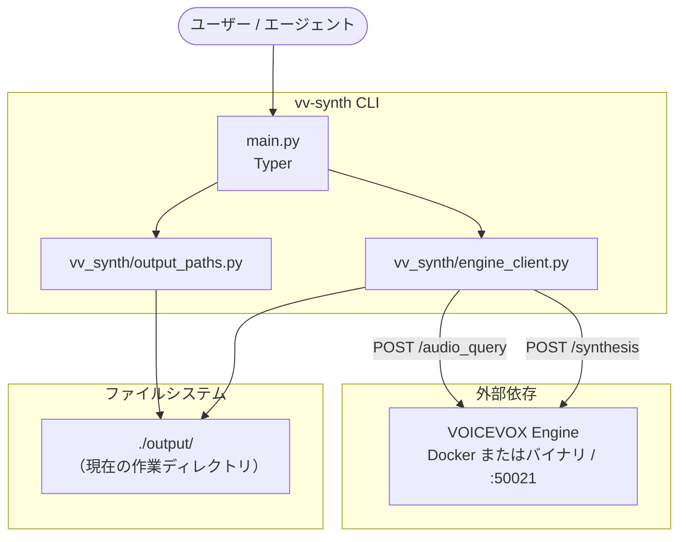
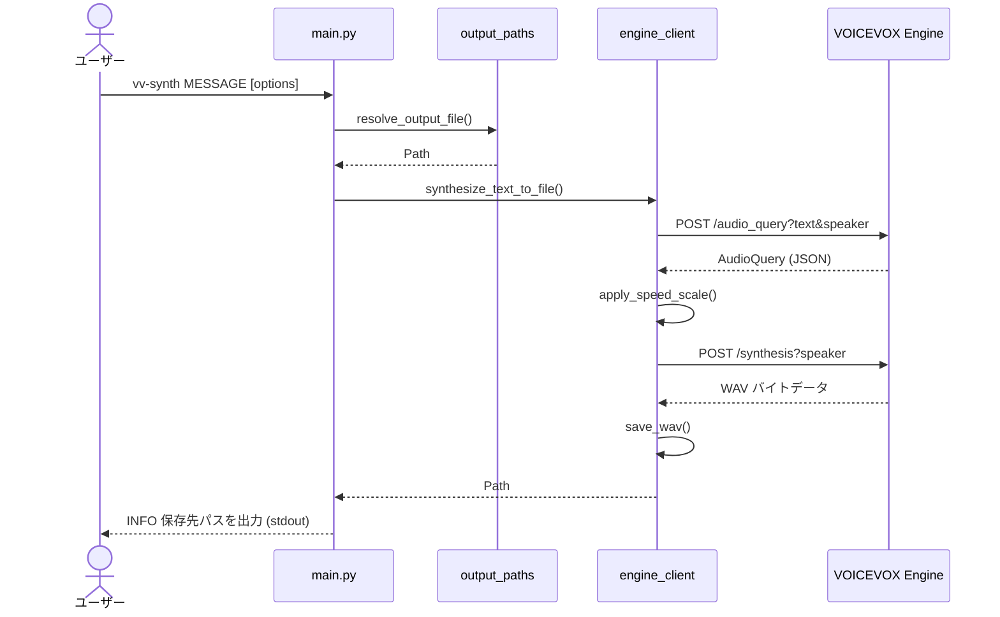

# vv-synth

[English Version](README.md)

`vv-synth` は、[VOICEVOX](https://voicevox.hiroshiba.jp/) Engine にテキストを送信し、合成された音声をローカルの WAV ファイルに保存する軽量な CLI ツールです。

このプロジェクトは意図的にシンプルな構成を保っています：

- `vv-synth` は、別途用意した VOICEVOX Engine と HTTP 経由で通信します。
- VOICEVOX Engine、音声ライブラリ、モデルファイル、Docker イメージ、公式バイナリ、および生成された WAV ファイルは、本リポジトリには同梱されていません。
- 実行時の処理は、主に [`vv_synth/engine_client.py`](vv_synth/engine_client.py)、[`vv_synth/output_paths.py`](vv_synth/output_paths.py)、および [`main.py`](main.py) に集約されています。

## ドキュメント

- **ユーザー向け:** [クイックスタート](#クイックスタート) / [使い方](#使い方)
- **VOICEVOX 利用規約:** [OSS 公開と VOICEVOX の利用規約](#oss-公開と-voicevox-の利用規約)
- **メンテナ向け:** [アーキテクチャ](#アーキテクチャ) / [メンテナンス](#メンテナンス)
- **AI コーディングエージェント（Codex CLI / Claude Code 推奨）:** [`AGENTS.md`](AGENTS.md) / [`CLAUDE.md`](CLAUDE.md) / [`.claude/rules/`](.claude/rules/) / [`skills/README.md`](skills/README.md)
- **エージェントスキル:** ポータブルな TTS 用の [`skills/vv-synth/`](skills/vv-synth/)、本リポジトリ開発用の [`skills/vv-synth-dev/`](skills/vv-synth-dev/)

## 動作要件

| 要件 | 目的 |
|-------------|---------|
| Python 3.14+ | 実行環境 |
| [uv](https://docs.astral.sh/uv/) | 依存関係およびツールの管理 |
| [Docker](https://www.docker.com/) | VOICEVOX Engine の実行手段（任意） |
| VOICEVOX Engine | `http://127.0.0.1:50021` で動作する HTTP API（Docker または公式バイナリで用意） |

Python、uv、および接続可能な VOICEVOX Engine があれば、Windows でも利用できます。Windows で NVIDIA GPU を使用する場合は、[Windows + NVIDIA GPU](#windows--nvidia-gpu-docker-desktop) を参照してください。

`vv-synth` の実行に VOICEVOX CORE (`voicevox_core/`) は不要です。

## OSS 公開と VOICEVOX の利用規約

`vv-synth` は MIT ライセンスのもとで公開されているオープンソースソフトウェアであり、軽量な HTTP クライアント CLI のみを含んでいます。VOICEVOX Engine 本体、音声ライブラリ、モデルファイル、Docker イメージ、Windows/macOS/Linux 用の公式バイナリ、および生成された WAV ファイルは同梱していません。

ユーザーは、公式の最新 VOICEVOX 利用規約を確認し、遵守する責任を負います。生成された音声を使用する際は、VOICEVOX を利用したことがわかるクレジット表記と、各音声ライブラリ / 話者固有の利用規約の遵守が必要です。ただし、適用されるライセンスが必要なクレジット表記の省略を明示的に許諾している場合は、その許諾に従います。生成された音声をアプリケーションに組み込んだり再配布したりする場合は、最終的な配布物もそれらの利用規約やクレジット要件を満たしている必要があります。

生成された音声の利用を他者に許諾する際は、公式 VOICEVOX ソフトウェア利用規約の許諾内容 2・3 に従い、その相手にも各音声ライブラリの規約を遵守させ、さらに別の相手へ音声の利用を許諾する場合にも同じ義務を引き継がせる必要があります。

参考リンク:

- [VOICEVOX 公式 ソフトウェア利用規約](https://voicevox.hiroshiba.jp/term/)
- [Docker Hub の voicevox/voicevox_engine](https://hub.docker.com/r/voicevox/voicevox_engine)
- [VOICEVOX Engine リリース一覧](https://github.com/VOICEVOX/voicevox_engine/releases)
- [VOICEVOX Q&A](https://voicevox.hiroshiba.jp/qa/)

変更およびリリース時のメンテナ用チェックリスト:

- `LICENSE`（MIT）のコードライセンスが `pyproject.toml` のライセンスメタデータと一致していることを確認する。
- `pyproject.toml` の `version`、両方の `skills/*/SKILL.md` 内の `metadata.version`、およびリリース用のタグ `v<version>`（`gh skill publish --tag` で作成）が一致していることを確認する。
- 本 README 内の VOICEVOX 公式リンクが最新であることを確認する。
- VOICEVOX Engine、音声ライブラリ、モデルファイル、および生成された WAV ファイルが Git の追跡対象になっていないことを確認する。
- サンプル音声を配布する場合は、事前に話者固有の規約とクレジット表記を確認する。

## VOICEVOX Engine の準備

`vv-synth` に必要なのは、`http://127.0.0.1:50021` で HTTP リクエストを受け付ける Engine だけです。VOICEVOX のデスクトップ GUI は不要です。

Docker を利用する場合は公式イメージを使用してください。Docker を使用しない場合は、[VOICEVOX Engine リリース一覧](https://github.com/VOICEVOX/voicevox_engine/releases) からお使いの OS に適した公式 Engine バイナリを使用してください。

情報源: [Docker Hub の voicevox/voicevox_engine](https://hub.docker.com/r/voicevox/voicevox_engine)、[Docker Desktop GPU サポート](https://docs.docker.com/desktop/features/gpu/)、[VOICEVOX Q&A](https://voicevox.hiroshiba.jp/qa/)

### Docker CPU

イメージをプルします:

```shell
docker pull voicevox/voicevox_engine:cpu-latest
```

フォアグラウンドで実行する場合:

```shell
docker run --rm -it -p '127.0.0.1:50021:50021' voicevox/voicevox_engine:cpu-latest
```

バックグラウンドで実行する場合:

```shell
docker run --rm -d -p '127.0.0.1:50021:50021' voicevox/voicevox_engine:cpu-latest
```

バックグラウンドコンテナを停止するには、`docker ps` で確認後、`docker stop <id>` を実行します。

### Windows + NVIDIA GPU (Docker Desktop)

Docker を使って Windows 上で GPU を使用するには以下が必要です:

- NVIDIA GPU を搭載した Windows 10 / 11
- WSL2 バックエンドが有効化された Docker Desktop
- WSL2 での GPU 利用をサポートする最新の NVIDIA ドライバー
- 最新の WSL2 Linux カーネル（PowerShell で `wsl --update` を実行）

Docker が GPU を認識できるか確認します:

```shell
docker run --rm -it --gpus=all nvcr.io/nvidia/k8s/cuda-sample:nbody nbody -gpu -benchmark
```

NVIDIA GPU 版 Engine イメージを実行します:

```shell
docker pull voicevox/voicevox_engine:nvidia-latest
docker run --rm -it --gpus all -p '127.0.0.1:50021:50021' voicevox/voicevox_engine:nvidia-latest
```

バックグラウンド実行:

```shell
docker run --rm -d --gpus all -p '127.0.0.1:50021:50021' voicevox/voicevox_engine:nvidia-latest
```

Engine が起動してリクエストを受け付ける状態になれば、`vv-synth` の使い方は CPU モードと同じです。GPU の設定は Engine 側で行うため、`vv-synth` 側で GPU 固有のオプションを指定する必要はありません。

### 公式 Engine バイナリ

Docker を使用しない場合は、[VOICEVOX Engine リリース一覧](https://github.com/VOICEVOX/voicevox_engine/releases) からお使いの OS に適した公式バイナリをダウンロードしてください。Windows 用ビルドには CPU、GPU/DirectML、GPU/CUDA の各バリアントが用意されています。

`http://127.0.0.1:50021/version` から応答が得られるようになれば、`vv-synth` は Docker 版と同様にバイナリ版 Engine を使用できます。ポート番号を変更した場合は、`--engine-url` を渡すか、`VOICEVOX_ENGINE_URL` を設定してください。

### Engine の動作確認

別のターミナルで以下を実行します:

```shell
curl -sSf http://127.0.0.1:50021/version
```

JSON が返ってくれば Engine の準備は完了です。話者のスタイル ID は [http://127.0.0.1:50021/docs](http://127.0.0.1:50021/docs) 内の `/speakers` から取得できます。

### Engine のトラブルシューティング

| 症状 | 確認事項 |
|---------|-------|
| `Cannot connect to the Docker daemon` | Docker Desktop を起動するか、公式 Engine バイナリを使用してください |
| ポート 50021 で `port is already allocated` が発生する | 他の Engine コンテナや VOICEVOX デスクトップアプリを停止してください |
| GPU コンテナがドライバーを選択できない | Docker Desktop の WSL2 バックエンド、NVIDIA ドライバー、および `wsl --update` を確認してください |
| `vv-synth` が接続できない | `curl .../version` が動作し、ポートが `127.0.0.1:50021` であることを確認してください |
| 話者に対して HTTP 4xx エラーが発生する | `/speakers` から有効なスタイル ID を選択してください |

ポート 50021 で複数の Engine を同時に実行しないでください。

## クイックスタート

```shell
git clone https://github.com/ru-461/vv-synth.git
cd vv-synth
uv sync
uv run vv-synth --help
```

Docker または公式バイナリで VOICEVOX Engine を起動したのち、以下を実行します:

```shell
uv run vv-synth "こんにちは、音声合成のテストです。"
```

デフォルトの出力先は、コマンドを実行したディレクトリ配下の `output/YYYYMMDD-HHMMSS.wav`（ローカル時間）です。`output/` ディレクトリは初回実行時に自動生成されます。グローバルでデフォルトのディレクトリを変更したい場合は `VV_SYNTH_OUTPUT_DIR` を設定してください。

## グローバルインストール

GitHub から直接インストール（リポジトリのクローンは不要）:

```shell
uv tool install git+https://github.com/ru-461/vv-synth
```

ローカルのクローンからインストール（編集可能モード）:

```shell
uv tool install --editable .
```

以下 2 つのコマンドがインストールされ、まったく同様に動作します:

- `vv-synth` — 正式名称
- `vvs` — 短縮エイリアス

`~/.local/bin` が `PATH` に通っていない場合:

```shell
uv tool update-shell
# または
export PATH="$HOME/.local/bin:$PATH"
```

アンインストール:

```shell
uv tool uninstall vv-synth
```

編集可能モードでインストールした後にリポジトリのパスを変更した場合は、再インストールを行ってください:

```shell
uv tool uninstall vv-synth
cd /path/to/vv-synth
uv tool install --editable .
```

## エージェントスキルのローカルインストール

ポータブルな `vv-synth` エージェントスキルを使用することで、コーディングエージェントが他のプロジェクトからこの CLI を利用できるようになります。推奨されるインストール方法は `gh skill` ですが、代替として `npx skills`（Vercel Labs）もサポートされています。

### 推奨: `gh skill`

GitHub CLI v2.90+ が必要です:

```shell
cd /path/to/vv-synth
gh skill install . vv-synth --from-local --scope user --agent universal
```

特定のエージェントのみにスキルをインストールしたい場合は、対象を指定してください:

```shell
gh skill install . vv-synth --from-local --scope user --agent codex
gh skill install . vv-synth --from-local --scope user --agent claude-code
```

インストール前に公開スキルの内容を確認できます（GitHub から読み込みます。ローカルクローンの場合は `skills/vv-synth/SKILL.md` を直接確認してください）:

```shell
gh skill preview ru-461/vv-synth vv-synth
```

### 代替方法: `npx skills`

Node.js が必要ですが、グローバルインストールは不要です。`--global` はユーザーディレクトリを対象とします（現在のプロジェクト内のみに限定する場合は付与しないでください）:

```shell
cd /path/to/vv-synth
npx skills@latest add . --skill vv-synth --global
```

特定のエージェントを指定するか、インストール前にリポジトリのスキル一覧を表示します:

```shell
npx skills@latest add . --skill vv-synth --global --agent claude-code
npx skills@latest add . --list
```

公開、更新、およびプロジェクト単位のインストール方法については [`skills/README.md`](skills/README.md) を参照してください。

## 使い方

```shell
vv-synth MESSAGE [OPTIONS]
```

`vv-synth --help` は英語で表示されます。

成功時は `INFO: wrote <絶対パス>` を stdout に出力します。合成やファイル入出力のエラーは英語 1 行で stderr に出力し、終了コードは 1 です。引数やオプションが不正な場合は、Typer の使用方法エラーを stderr に表示し、終了コードは 2 です。

| オプション | 短縮形 | デフォルト値 | 説明 |
|--------|-------|---------|-------------|
| `MESSAGE` | - | 必須 | 合成するテキスト |
| `--output` | `-o` | 自動タイムスタンプ | 出力する WAV ファイル名またはパス |
| `--output-dir` | - | `output` | `--output` がファイル名のみの場合に使用されるディレクトリ。`VV_SYNTH_OUTPUT_DIR` でも設定可能 |
| `--speaker` | `-s` | `2` | VOICEVOX 話者のスタイル ID |
| `--speed` | - | `1.0` | 話速は有限の数値 `0.01`〜`10.0`（`1.0` が標準。値が大きいほど速くなる） |
| `--engine-url` | - | `http://127.0.0.1:50021` | Engine の URL。`VOICEVOX_ENGINE_URL` でも設定可能 |

実行例:

```shell
vv-synth "テストです" -o hello.wav
vv-synth "テストです" --output-dir artifacts
vv-synth "テストです" -s 3 --speed 1.5
```

話者スタイル ID の確認: [http://127.0.0.1:50021/docs](http://127.0.0.1:50021/docs) の `/speakers`

## アーキテクチャ

### コンポーネント構成

モジュールの境界に変更があった場合は、以下の図も実装と一致するように更新してください。



| パス | 役割 |
|------|----------------|
| `main.py` | Typer CLI および `vv-synth` のエントリーポイント |
| `vv_synth/output_paths.py` | 出力パスの解決（`output/`、`-o`、タイムスタンプ名） |
| `vv_synth/engine_client.py` | Engine への HTTP リクエスト、話速の適用、WAV の保存 |

### 処理フロー

Engine API の呼び出し順序が変更された場合は、以下のシーケンス図を更新してください。



### プロジェクト構成

```text
vv-synth/
├── main.py
├── vv_synth/
│   ├── engine_client.py
│   └── output_paths.py
├── tests/               # pytest テストスイート（Engine はモック化。Engine の起動は不要）
├── output/              # Git 管理外の WAV 出力先（.gitkeep を除く）
├── docs/                # 日本語のプロジェクト概要（OVERVIEW.ja.md）
├── skills/              # エージェントスキル（vv-synth, vv-synth-dev）
├── .claude/rules/       # AGENTS.md から参照されるエージェントルール
├── .github/             # CI ワークフロー、Dependabot、Issue / PR テンプレート、行動規範
├── pyproject.toml       # vv-synth パッケージおよび [project.scripts]
├── AGENTS.md            # 共通のエージェント向けガイドライン
├── CLAUDE.md            # Claude Code 向けサマリー
├── CONTRIBUTING.md      # 貢献ガイド
├── SECURITY.md          # セキュリティポリシー
├── README.md            # 英語メイン README
├── README.ja.md         # 日本語 README
├── LICENSE              # MIT（コードのみ。生成音声は VOICEVOX 利用規約に従う）
└── uv.lock
```

## 出力ディレクトリ

デフォルトでは、WAV ファイルはコマンドを実行した作業ディレクトリ内の `output/` 配下に書き出されます。

| 呼び出し方法 | 出力例 |
|------------|----------------|
| `-o` なし | `output/20260521-143052.wav` |
| `-o hello.wav` | `output/hello.wav` |
| `-o path/to/a.wav` | `path/to/a.wav` |
| `--output-dir artifacts` | `artifacts/...` |

## VOICEVOX CORE

`vv-synth` は VOICEVOX Engine の HTTP API のみを使用します。VOICEVOX CORE、音声ライブラリ、およびモデルファイルは本 CLI に同梱されておらず、セットアップ手順にも含まれません。

## メンテナンス

### 開発環境の構築

```shell
uv sync --group dev
```

Docker または公式バイナリで VOICEVOX Engine を起動し、以下で確認します:

```shell
curl -sSf http://127.0.0.1:50021/version
```

### 変更対応マップ

| 変更内容 | 主要ファイル | 併せて更新する項目 |
|--------|---------------|-------------|
| CLI オプション/ヘルプ | `main.py` | [使い方](#使い方)、`vv-synth --help` の文言 |
| 出力パスのルール | `vv_synth/output_paths.py` | [出力ディレクトリ](#出力ディレクトリ) |
| Engine API/話速/エラー処理 | `vv_synth/engine_client.py` | Mermaid 図 |
| グローバルコマンド名 | `pyproject.toml` の `[project.scripts]` | インストール手順 |
| 依存パッケージのバージョン | `pyproject.toml` | `uv lock` / `uv.lock` |
| エージェントのルール/境界 | `AGENTS.md`、`CLAUDE.md`、`.claude/rules/*.md` | アーキテクチャの表 |
| Engine のセットアップや規約案内 | README 類、`skills/*/SKILL.md` | 公式リンク、Docker/バイナリの整合性 |

### Mermaid 図の更新

アーキテクチャ図の正本は [`README.md`（英語版）](README.md#architecture) にあります。以下のような場合は更新を行ってください:

- モジュールの追加、名称変更、あるいは役割の変更があった場合
- Engine API のエンドポイントや呼び出し順序が変更された場合
- ファイルシステムや外部サービスに対する CLI の依存関係が変更された場合

図の内容を変更した場合は、`README.ja.md` や `docs/OVERVIEW.ja.md` のコピーも常に同期させてください。

### 品質チェック

```shell
uv run ruff check .
uv run ruff format .
uv run ty check
uv run pytest
```

`pytest` は `tests/` 内の単体テストスイートを実行します。テスト内では `urllib` 経由の Engine 通信がモック化されているため、VOICEVOX Engine を起動しておく必要はありません。

Engine を稼働させた状態での手動スモークテスト:

```shell
uv run vv-synth "maintenance smoke test"
ls -la output/
```

パッケージのエントリーポイントを変更した場合:

```shell
uv tool install --editable .
vv-synth --help
```

### ドキュメント同期チェックリスト

- [ ] `README.md` と `README.ja.md` が、ユーザーから見た同じ挙動を説明していること。
- [ ] Mermaid 図が実装と一致していること。
- [ ] `AGENTS.md` / `CLAUDE.md` およびエージェントスキルが最新に保たれていること。
- [ ] CLI オプションの表が `vv-synth --help` と一致していること。
- [ ] VOICEVOX Engine / 音声ライブラリの利用規約リンク、および「外部アセットをバンドルしない」方針が維持されていること。
- [ ] `LICENSE` と `pyproject.toml` のライセンスメタデータが一致していること。

### コミットポリシー

- 明示的に要求された場合のみコミットしてください。
- 英語 1 行のメッセージを使用してください: `prefix: message`
- 例: `feat: add pitch option`、`docs: update engine setup`
- `output/*.wav`、`voicevox_core/`、`download`、VOICEVOX Engine のバイナリ、モデル、音声ライブラリ、仮想環境などはコミットしないでください。

## トラブルシューティング

| 症状 | 確認事項 |
|---------|-------|
| `command not found: vv-synth` | `uv tool install --editable .` を実行し、PATH（`~/.local/bin`）を確認してください |
| `Connection refused` | Docker または公式バイナリで Engine を起動し、ポート 50021 を確認してください |
| HTTP 4xx エラー | `--speaker` で指定しているスタイル ID を確認してください |
| WAV ファイルが保存されない | 現在の作業ディレクトリ、`--output-dir`、および書き込み権限を確認してください |
| Mermaid 図がレンダリングされない | Markdown のコードブロック指定が ` ```mermaid ` になっているか確認してください |
