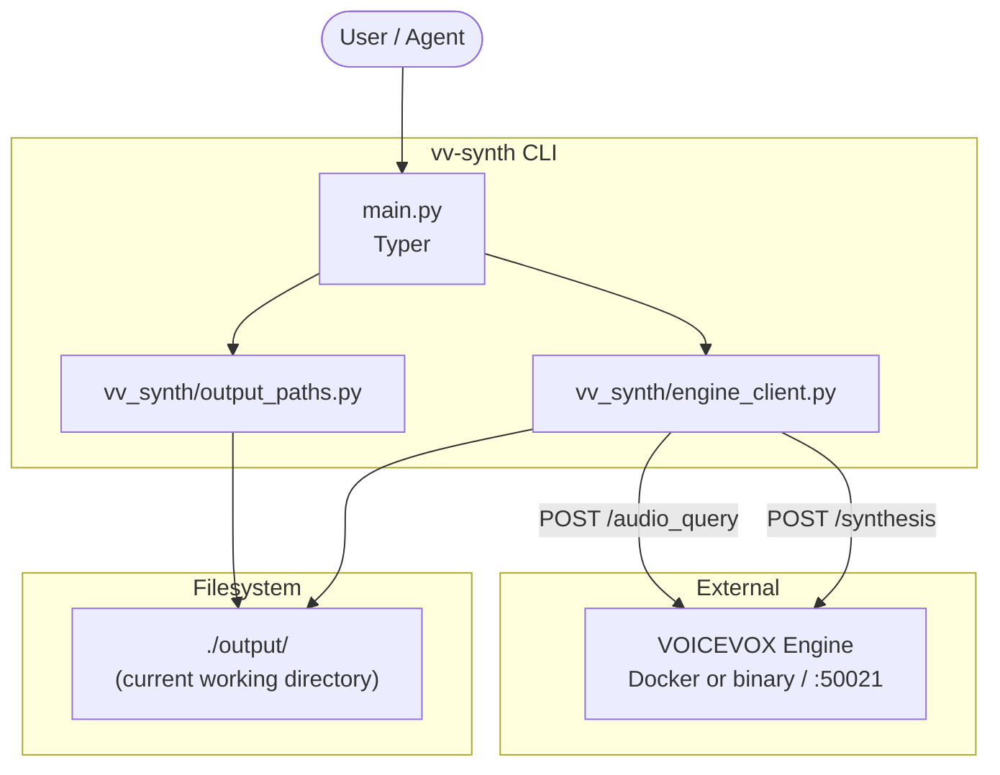
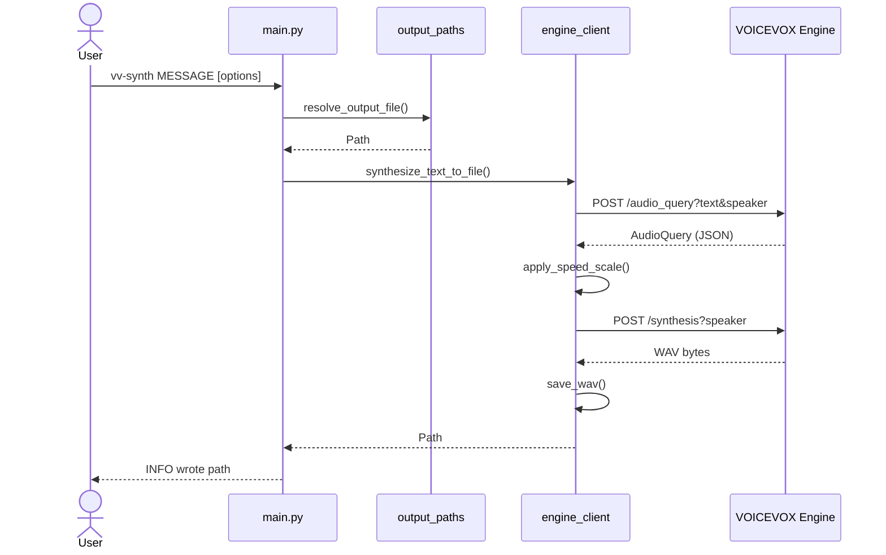

# vv-synth

[日本語版](README.ja.md)

`vv-synth` is a small CLI that sends text to [VOICEVOX](https://voicevox.hiroshiba.jp/) Engine and writes the synthesized audio as a local WAV file.

The project intentionally stays thin:

- `vv-synth` talks to a separately prepared VOICEVOX Engine over HTTP.
- VOICEVOX Engine, voice libraries, model files, Docker images, official binaries, and generated WAV files are not bundled in this repository.
- Runtime behavior is centered in [`vv_synth/engine_client.py`](vv_synth/engine_client.py), [`vv_synth/output_paths.py`](vv_synth/output_paths.py), and [`main.py`](main.py).

## Documentation

- **Users:** [Quick Start](#quick-start) / [Usage](#usage)
- **VOICEVOX terms:** [OSS Publication And VOICEVOX Terms](#oss-publication-and-voicevox-terms)
- **Maintainers:** [Architecture](#architecture) / [Maintenance](#maintenance)
- **AI coding agents (Codex CLI / Claude Code recommended):** [`AGENTS.md`](AGENTS.md) / [`CLAUDE.md`](CLAUDE.md) / [`.claude/rules/`](.claude/rules/) / [`skills/README.md`](skills/README.md)
- **Agent Skills:** [`skills/vv-synth/`](skills/vv-synth/) for portable TTS, [`skills/vv-synth-dev/`](skills/vv-synth-dev/) for this repository

## Requirements

| Requirement | Purpose |
|-------------|---------|
| Python 3.14+ | Runtime |
| [uv](https://docs.astral.sh/uv/) | Dependency and tool management |
| [Docker](https://www.docker.com/) | Optional way to run VOICEVOX Engine |
| VOICEVOX Engine | HTTP API on `http://127.0.0.1:50021`, prepared with Docker or an official binary |

Windows is supported as long as Python, uv, and a reachable VOICEVOX Engine are available. For Windows NVIDIA GPU usage, see [Windows + NVIDIA GPU](#windows--nvidia-gpu-docker-desktop).

VOICEVOX CORE (`voicevox_core/`) is not required by `vv-synth`.

## OSS Publication And VOICEVOX Terms

`vv-synth` is open source under the MIT License and contains only the small HTTP client CLI. It does not vendor VOICEVOX Engine itself, voice libraries, model files, Docker images, official Windows/macOS/Linux binaries, or generated WAV files.

Users are responsible for checking and following the latest official VOICEVOX terms. Generated audio may require VOICEVOX credit and compliance with each voice library / speaker's own terms. If generated audio is embedded in an application or redistributed, the final distribution must also satisfy those terms and credit requirements.

References:

- [VOICEVOX official software terms](https://voicevox.hiroshiba.jp/term/)
- [voicevox/voicevox_engine on Docker Hub](https://hub.docker.com/r/voicevox/voicevox_engine)
- [VOICEVOX Engine Releases](https://github.com/VOICEVOX/voicevox_engine/releases)
- [VOICEVOX Q&A](https://voicevox.hiroshiba.jp/qa/)

Maintainer checklist for every change and release:

- Confirm the code license in `LICENSE` (MIT) matches the `pyproject.toml` license metadata.
- Confirm the VOICEVOX official links in this README are current.
- Confirm VOICEVOX Engine, voice libraries, model files, and generated WAV files are not tracked by Git.
- If sample audio is ever distributed, confirm speaker-specific terms and credit notation first.

## Prepare VOICEVOX Engine

`vv-synth` only needs an HTTP Engine listening on `http://127.0.0.1:50021`. The VOICEVOX desktop GUI is not required.

Docker users should use the official image. If you do not want Docker, use an official Engine binary from [VOICEVOX Engine Releases](https://github.com/VOICEVOX/voicevox_engine/releases).

Sources: [voicevox/voicevox_engine on Docker Hub](https://hub.docker.com/r/voicevox/voicevox_engine), [Docker Desktop GPU support](https://docs.docker.com/desktop/features/gpu/), [VOICEVOX Q&A](https://voicevox.hiroshiba.jp/qa/)

### Docker CPU

Pull the image:

```shell
docker pull voicevox/voicevox_engine:cpu-latest
```

Run in the foreground:

```shell
docker run --rm -it -p '127.0.0.1:50021:50021' voicevox/voicevox_engine:cpu-latest
```

Run in the background:

```shell
docker run --rm -d -p '127.0.0.1:50021:50021' voicevox/voicevox_engine:cpu-latest
```

Stop a background container with `docker ps`, then `docker stop <id>`.

### Windows + NVIDIA GPU (Docker Desktop)

Windows GPU usage with Docker requires:

- Windows 10 / 11 with an NVIDIA GPU
- Docker Desktop with the WSL2 backend enabled
- A current NVIDIA driver that supports WSL2 GPU usage
- A current WSL2 Linux kernel (`wsl --update` in PowerShell)

Check whether Docker can see the GPU:

```shell
docker run --rm -it --gpus=all nvcr.io/nvidia/k8s/cuda-sample:nbody nbody -gpu -benchmark
```

Run the NVIDIA GPU Engine image:

```shell
docker pull voicevox/voicevox_engine:nvidia-latest
docker run --rm -it --gpus all -p '127.0.0.1:50021:50021' voicevox/voicevox_engine:nvidia-latest
```

Background:

```shell
docker run --rm -d --gpus all -p '127.0.0.1:50021:50021' voicevox/voicevox_engine:nvidia-latest
```

After the Engine is listening, `vv-synth` usage is the same as CPU mode. GPU selection is an Engine concern; `vv-synth` does not need a GPU-specific option.

### Official Engine Binaries

If you do not use Docker, download an official binary for your OS from [VOICEVOX Engine Releases](https://github.com/VOICEVOX/voicevox_engine/releases). Windows builds include CPU, GPU/DirectML, and GPU/CUDA variants.

Once `http://127.0.0.1:50021/version` responds, `vv-synth` can use the binary Engine exactly like the Docker Engine. If you change the port, pass `--engine-url` or set `VOICEVOX_ENGINE_URL`.

### Verify The Engine

In another terminal:

```shell
curl -sSf http://127.0.0.1:50021/version
```

If JSON is returned, the Engine is ready. Speaker style IDs are available from `/speakers` in [http://127.0.0.1:50021/docs](http://127.0.0.1:50021/docs).

### Engine Troubleshooting

| Symptom | Check |
|---------|-------|
| `Cannot connect to the Docker daemon` | Start Docker Desktop, or use an official Engine binary |
| `port is already allocated` on 50021 | Stop other Engine containers or the VOICEVOX desktop app |
| GPU container cannot select a driver | Confirm Docker Desktop WSL2 backend, NVIDIA driver, and `wsl --update` |
| `vv-synth` cannot connect | Confirm `curl .../version` works and the port is `127.0.0.1:50021` |
| HTTP 4xx for speaker | Pick a valid style ID from `/speakers` |

Do not run multiple Engines on port 50021 at the same time.

## Quick Start

```shell
uv sync
uv run vv-synth --help
```

After starting VOICEVOX Engine with Docker or an official binary:

```shell
uv run vv-synth "こんにちは、音声合成のテストです。"
```

The default output is `output/YYYYMMDD-HHMMSS.wav` (local time) under the directory where you run the command. The `output/` directory is created automatically on first run. Set `VV_SYNTH_OUTPUT_DIR` to change the default directory globally.

## Global Install

```shell
uv tool install --editable .
```

Two commands are installed and behave identically:

- `vv-synth` — the canonical name
- `vvs` — short alias

If `~/.local/bin` is not on `PATH`:

```shell
uv tool update-shell
# or
export PATH="$HOME/.local/bin:$PATH"
```

Uninstall:

```shell
uv tool uninstall vv-synth
```

If the repository path changed, reinstall:

```shell
uv tool uninstall vv-synth
cd /path/to/vv-synth
uv tool install --editable .
```

## Agent Skill Local Install

The portable `vv-synth` Agent Skill lets coding agents use this CLI from other projects. `gh skill` is the recommended installation path; `npx skills` (Vercel Labs) is a supported alternative.

### Recommended: `gh skill`

Requires GitHub CLI v2.90+:

```shell
cd /path/to/vv-synth
gh skill install . vv-synth --from-local --scope user --agent universal
```

Use a specific agent target if you only want the skill installed for one host:

```shell
gh skill install . vv-synth --from-local --scope user --agent codex
gh skill install . vv-synth --from-local --scope user --agent claude-code
```

Preview before installing:

```shell
gh skill preview . vv-synth --from-local
```

### Alternative: `npx skills`

Requires Node.js; no global install needed. `--global` targets your user directory (omit it for the current project only):

```shell
cd /path/to/vv-synth
npx skills@latest add . --skill vv-synth --global
```

Target one agent, or list the repository's skills before installing:

```shell
npx skills@latest add . --skill vv-synth --global --agent claude-code
npx skills@latest add . --list
```

See [`skills/README.md`](skills/README.md) for publishing, updates, and project-scoped installs.

## Usage

```shell
vv-synth MESSAGE [OPTIONS]
```

`vv-synth --help` is written in English.

| Option | Short | Default | Description |
|--------|-------|---------|-------------|
| `MESSAGE` | - | required | Text to synthesize |
| `--output` | `-o` | automatic timestamp | Output WAV file name or path |
| `--output-dir` | - | `output` | Directory for WAV files when `--output` is a basename; can also be set with `VV_SYNTH_OUTPUT_DIR` |
| `--speaker` | `-s` | `2` | VOICEVOX speaker style ID |
| `--speed` | - | `1.0` | Speech speed (`1.0` is normal; larger is faster) |
| `--engine-url` | - | `http://127.0.0.1:50021` | Engine URL; can also be set with `VOICEVOX_ENGINE_URL` |

Examples:

```shell
vv-synth "テストです" -o hello.wav
vv-synth "テストです" --output-dir artifacts
vv-synth "テストです" -s 3 --speed 1.5
```

Speaker style IDs: [http://127.0.0.1:50021/docs](http://127.0.0.1:50021/docs), `/speakers`

## Architecture

### Component Layout

Keep this diagram aligned with the implementation when module boundaries change.



| Path | Responsibility |
|------|----------------|
| `main.py` | Typer CLI and `vv-synth` entry point |
| `vv_synth/output_paths.py` | Output path resolution (`output/`, `-o`, timestamp names) |
| `vv_synth/engine_client.py` | Engine HTTP calls, speech rate, WAV saving |

### Synthesis Flow

Update this sequence if the Engine API call order changes.



### Project Layout

```text
vv-synth/
├── main.py
├── vv_synth/
│   ├── engine_client.py
│   └── output_paths.py
├── tests/               # pytest suite (Engine mocked; no running Engine needed)
├── output/              # Git-ignored WAV output, except .gitkeep
├── docs/                # Japanese project overview (OVERVIEW.ja.md)
├── skills/              # Agent Skills (vv-synth, vv-synth-dev)
├── .claude/rules/       # Agent rules referenced by AGENTS.md
├── .github/             # CI workflow, Dependabot, and issue / PR templates
├── pyproject.toml       # vv-synth package and [project.scripts]
├── AGENTS.md            # Shared agent guidance
├── CLAUDE.md            # Claude Code summary
├── CONTRIBUTING.md      # Contribution guide
├── SECURITY.md          # Security policy
├── README.md            # English main README
├── README.ja.md         # Japanese README
├── LICENSE              # MIT (code only; generated audio follows VOICEVOX terms)
└── uv.lock
```

## Output Directory

By default, WAV files are written under `output/` relative to the command's current working directory.

| Invocation | Output example |
|------------|----------------|
| no `-o` | `output/20260521-143052.wav` |
| `-o hello.wav` | `output/hello.wav` |
| `-o path/to/a.wav` | `path/to/a.wav` |
| `--output-dir artifacts` | `artifacts/...` |

## VOICEVOX CORE

`vv-synth` only uses the VOICEVOX Engine HTTP API. VOICEVOX CORE, voice libraries, and model files are not bundled with this CLI and are not part of its setup flow.

## Maintenance

### Environment

```shell
uv sync --group dev
```

Start VOICEVOX Engine with Docker or an official binary, then confirm:

```shell
curl -sSf http://127.0.0.1:50021/version
```

### Change Map

| Change | Primary files | Also update |
|--------|---------------|-------------|
| CLI options/help | `main.py` | [Usage](#usage), `vv-synth --help` wording |
| Output path rules | `vv_synth/output_paths.py` | [Output Directory](#output-directory) |
| Engine API/speed/errors | `vv_synth/engine_client.py` | Mermaid diagrams |
| Global command name | `pyproject.toml` `[project.scripts]` | install instructions |
| Dependency versions | `pyproject.toml` | `uv lock` / `uv.lock` |
| Agent rules/boundaries | `AGENTS.md`, `CLAUDE.md`, `.claude/rules/*.md` | Architecture tables |
| Engine setup or VOICEVOX terms guidance | README files, `skills/*/SKILL.md` | official links and Docker/binary parity |

### Mermaid Updates

The canonical architecture diagrams live in this README. Update them when:

- modules are added, renamed, or change responsibility;
- Engine API endpoints or call order change;
- CLI dependencies on the filesystem or external services change.

Keep the copies in `README.ja.md` and `docs/OVERVIEW.ja.md` aligned when diagram content changes.

### Quality Checks

```shell
uv run ruff check .
uv run ruff format .
uv run ty check
uv run pytest
```

`pytest` runs the unit test suite in `tests/`. Tests mock the Engine over `urllib`, so no
running VOICEVOX Engine is required.

Manual smoke test with Engine running:

```shell
uv run vv-synth "maintenance smoke test"
ls -la output/
```

If package entry points changed:

```shell
uv tool install --editable .
vv-synth --help
```

### Documentation Sync Checklist

- [ ] `README.md` and `README.ja.md` describe the same user-facing behavior.
- [ ] Mermaid diagrams match the implementation.
- [ ] `AGENTS.md` / `CLAUDE.md` and Agent Skills are current.
- [ ] CLI option tables match `vv-synth --help`.
- [ ] VOICEVOX Engine / voice library terms links and the "do not vendor external assets" policy remain intact.
- [ ] `LICENSE` and the `pyproject.toml` license metadata still match.

### Commit Policy

- Commit only when explicitly requested.
- Use an English one-line message: `prefix: message`.
- Examples: `feat: add pitch option`, `docs: update engine setup`.
- Do not commit `output/*.wav`, `voicevox_core/`, `download`, VOICEVOX Engine binaries, models, voice libraries, or virtual environments.

## Troubleshooting

| Symptom | Check |
|---------|-------|
| `command not found: vv-synth` | `uv tool install --editable .` and PATH (`~/.local/bin`) |
| `Connection refused` | Start Engine with Docker or an official binary; confirm port 50021 |
| HTTP 4xx | Check the `--speaker` style ID |
| WAV is not saved | Current working directory, `--output-dir`, and write permissions |
| Mermaid does not render | Markdown fence must be ` ```mermaid ` |
