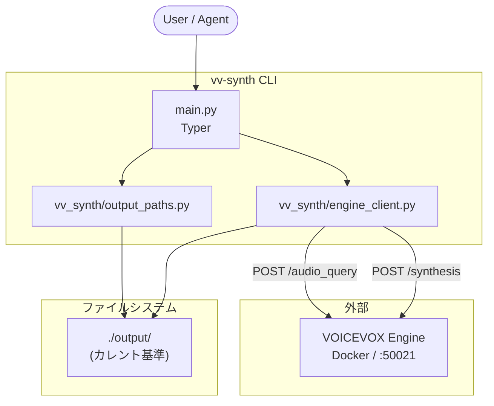
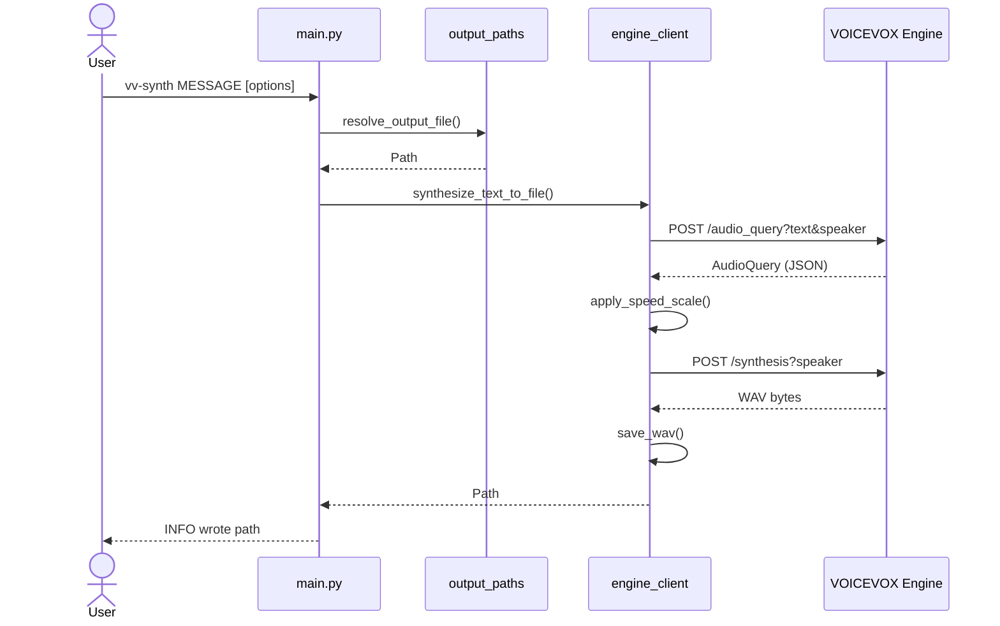

# vv-synth

[VOICEVOX](https://voicevox.hiroshiba.jp/) Engine でテキストを WAV に合成する CLI です。

`vv-synth` に読み上げテキストを渡すと、合成した WAV を保存します。HTTP API の参考実装は `samples/engine_http_sample.py` に残しています。

- **利用者向け:** [クイックスタート](#クイックスタート) / [使い方](#使い方)
- **メンテナ向け:** [アーキテクチャ](#アーキテクチャ) / [メンテナンス手順](#メンテナンス手順)
- **AI エージェント向け:** [`AGENTS.md`](AGENTS.md) / [`CLAUDE.md`](CLAUDE.md) / [`skills/README.md`](skills/README.md)（`gh skill install` で Cursor・Claude Code・Codex 等へ）
- **Agent Skills:** [`skills/vv-synth/`](skills/vv-synth/)（任意プロジェクト向け TTS）、[`skills/vv-synth-dev/`](skills/vv-synth-dev/)（本リポ開発）

## 必要なもの

| 項目 | 用途 |
|------|------|
| Python 3.14+ | 実行環境 |
| [uv](https://docs.astral.sh/uv/) | 依存関係管理 |
| [Docker](https://www.docker.com/) | VOICEVOX Engine コンテナの起動 |
| VOICEVOX Engine (起動済み) | HTTP API (`http://127.0.0.1:50021`) — [Docker](#voicevox-engine-の起動-docker) で起動 |

VOICEVOX CORE (`voicevox_core/`) は `vv-synth` では不要です。コアライブラリを試すときだけ [VOICEVOX CORE のセットアップ](#voicevox-core-のセットアップ-任意) を参照してください。

## VOICEVOX Engine の起動 (Docker)

`vv-synth` が使うのは **HTTP で応答する Engine だけ** です。GUI の VOICEVOX デスクトップアプリは不要です。  
本プロジェクトでは **Docker 公式イメージ** で Engine を起動します。

出典: [voicevox/voicevox_engine on Docker Hub](https://hub.docker.com/r/voicevox/voicevox_engine)

### 1. イメージの取得（初回のみ）

```shell
docker pull voicevox/voicevox_engine:cpu-latest
```

Apple Silicon / Intel Mac とも CPU 版で問題ないことが多いです。NVIDIA GPU 環境のみ `nvidia-latest` タグを検討してください（Docker Hub 参照）。

### 2. Engine を起動する

**推奨コマンド**（フォアグラウンド。ログが見え、停止は `Ctrl+C`）:

```shell
docker run --rm -it -p '127.0.0.1:50021:50021' voicevox/voicevox_engine:cpu-latest
```

- `--rm` … 停止時にコンテナを削除
- `-p '127.0.0.1:50021:50021'` … ホストの localhost:50021 をコンテナに転送（`vv-synth` の既定 URL と一致）
- このターミナルは Engine 起動中は占有されます。合成は **別ターミナル** で `vv-synth` を実行します。

**バックグラウンド起動**（開発で Engine を裏に置きたいとき）:

```shell
docker run --rm -d -p '127.0.0.1:50021:50021' voicevox/voicevox_engine:cpu-latest
```

停止例: `docker ps` で CONTAINER ID を確認し `docker stop <id>`。

### 3. 起動確認

Engine 起動中に、別ターミナルで:

```shell
curl -sSf http://127.0.0.1:50021/version
```

JSON が返れば OK。話者 ID は [http://127.0.0.1:50021/docs](http://127.0.0.1:50021/docs) の `/speakers`。

### 4. `vv-synth` で合成する

```shell
vv-synth "こんにちは、Docker Engine のテストです。"
```

成功するとカレントディレクトリの `output/YYYYMMDD-HHMMSS.wav` ができます。

### トラブルシュート（Docker）

| 症状 | 対処 |
|------|------|
| `Cannot connect to the Docker daemon` | Docker Desktop を起動 |
| `port is already allocated` (50021) | 既存の Engine コンテナまたはデスクトップ VOICEVOX を停止 |
| `vv-synth` が接続できない | コンテナが動いているか `curl .../version`、ポートが `127.0.0.1:50021` か確認 |
| 話者 ID エラー (HTTP 4xx) | `/docs` の `/speakers` で `--speaker` を合わせる |

**注意:** デスクトップ VOICEVOX アプリもポート 50021 を使います。Docker Engine と **同時に起動しない** でください。

## クイックスタート

```shell
uv sync
uv run vv-synth --help
```

[Docker で Engine を起動](#voicevox-engine-の起動-docker) したあと（別ターミナルで）:

```shell
vv-synth "こんにちは、音声合成のテストです。"
```

`vv-synth` が PATH にない場合は [グローバルインストール](#グローバルインストール) を行うか、プロジェクト内では `uv run vv-synth` を使います。

成功すると、実行したディレクトリの `output/YYYYMMDD-HHMMSS.wav` が作成されます。

## グローバルインストール

```shell
uv tool install --editable .
```

`~/.local/bin` が PATH にない場合:

```shell
uv tool update-shell
# または
export PATH="$HOME/.local/bin:$PATH"
```

旧パッケージ名・旧ディレクトリ名からの移行:

```shell
uv tool uninstall voicevox-playground   # 旧 uv tool 名（あれば）
uv tool uninstall vv-synth              # パスが変わった場合は再インストールのため
cd /path/to/vv-synth                    # 旧: voicevox-playground
uv tool install --editable .
```

アンインストール: `uv tool uninstall vv-synth`

## 使い方

```shell
vv-synth MESSAGE [OPTIONS]
```

`vv-synth --help` のオプション説明は英語です。

| オプション | 短縮 | 既定値 | 説明 |
|------------|------|--------|------|
| `MESSAGE` | — | (必須) | 読み上げるテキスト |
| `--output` | `-o` | 自動命名 | 出力 WAV のファイル名またはパス |
| `--output-dir` | — | `output` | WAV を保存するディレクトリ |
| `--speaker` | `-s` | `2` | 話者スタイル ID |
| `--speed` | — | `1.0` | 話速 (`1.0` が標準。大きいほど速い) |
| `--engine-url` | — | `http://127.0.0.1:50021` | Engine の URL (`VOICEVOX_ENGINE_URL` 可) |

```shell
vv-synth "テストです" -o hello.wav
vv-synth "テストです" --output-dir artifacts
vv-synth "テストです" -s 3 --speed 1.5
```

話者スタイル ID: [http://127.0.0.1:50021/docs](http://127.0.0.1:50021/docs) の `/speakers`

## アーキテクチャ

### コンポーネント構成

メンテナンス時は、この図の **ノード名・矢印・モジュール境界** が実装と一致しているかを確認してください。



| パス | 責務 |
|------|------|
| `main.py` | Typer CLI、`vv-synth` エントリーポイント |
| `vv_synth/output_paths.py` | 出力パス解決 (`output/`、`-o`、タイムスタンプ名) |
| `vv_synth/engine_client.py` | Engine HTTP 呼び出し、WAV 保存 |
| `samples/engine_http_sample.py` | Typer 導入前の参考実装 (CLI からは未使用) |

### 合成処理の流れ

Engine API の呼び出し順序を変えたときは、このシーケンス図も更新してください。



### プロジェクト構成

```
vv-synth/
├── main.py
├── vv_synth/
│   ├── engine_client.py
│   └── output_paths.py
├── samples/
│   └── engine_http_sample.py
├── output/              # Git 除外 (WAV)
├── pyproject.toml       # vv-synth パッケージ、[project.scripts]
├── AGENTS.md            # Cursor 等向け
├── CLAUDE.md            # Claude Code 向け
└── uv.lock
```

## 出力先 (`output/`)

合成 WAV は **コマンドを実行したディレクトリ** の `output/` が既定です。詳細は [output/README.md](output/README.md)。

| 指定 | 保存先の例 |
|------|------------|
| `-o` 省略 | `output/20260521-143052.wav` |
| `-o hello.wav` | `output/hello.wav` |
| `-o path/to/a.wav` | 指定パスそのまま |
| `--output-dir artifacts` | `artifacts/...` |

## VOICEVOX CORE のセットアップ (任意)

```shell
binary=download-osx-arm64  # Intel Mac: download-osx-x64
curl -sSfL "https://github.com/VOICEVOX/voicevox_core/releases/latest/download/${binary}" -o download
chmod +x download
./download
```

手順まとめ: Notion「VOICEVOXセットアップ」

## 参考用サンプル

```shell
uv run python samples/engine_http_sample.py
```

## メンテナンス手順

このリポジトリを継続的に直すときの標準フローです。AI エージェントが変更するときも同じ手順に従ってください。

### 1. 環境の準備

```shell
uv sync --group dev
```

Docker で Engine を起動し、`curl -sSf http://127.0.0.1:50021/version` が成功することを確認します（[起動手順](#voicevox-engine-の起動-docker)）。

### 2. 変更の種類ごとの編集先

| 変更内容 | 主に触るファイル | あわせて更新 |
|----------|------------------|--------------|
| CLI オプション・ヘルプ | `main.py` | README [使い方](#使い方)、`--help` 文言 |
| 出力パス・ファイル名規則 | `vv_synth/output_paths.py` | README [出力先](#出力先-output)、`output/README.md` |
| Engine API・話速・エラー | `vv_synth/engine_client.py` | 下記 [グラフの更新](#3-グラフmermaidの更新) |
| グローバルコマンド名 | `pyproject.toml` `[project.scripts]` | README、`uv tool install` 手順 |
| 依存バージョン | `pyproject.toml` | `uv lock` → `uv.lock` |
| AI 向けルール・境界 | `AGENTS.md`, `CLAUDE.md` | 本 README のアーキテクチャ表 |

### 3. グラフ (Mermaid) の更新

アーキテクチャ図は **この README 内の Mermaid ブロック** にのみ置いています（別ファイルの図はありません）。

**更新が必要なタイミング**

- モジュールの追加・リネーム・責務の変更
- Engine API エンドポイントや呼び出し順の変更
- CLI からファイルシステム・外部サービスへの依存関係の変更

**手順**

1. [コンポーネント構成](#コンポーネント構成) の `flowchart` を編集する  
   - ノード ID は英数字推奨 (`main`, `client` など)  
   - 表示ラベルに **実際のファイルパス** を書く (`vv_synth/engine_client.py` など)
2. API フローを変えたら [合成処理の流れ](#合成処理の流れ) の `sequenceDiagram` も同期する  
   - `POST` パスと関数名 (`synthesize_text_to_file` 等) を実装と一致させる
3. Cursor / GitHub の Markdown プレビューでレンダリングを確認する
4. [アーキテクチャ](#アーキテクチャ) の表（モジュール責務）と `AGENTS.md` の構成表を同じ内容に揃える

**更新不要なことが多い変更**

- ログメッセージのみ
- リファクタリングでファイル名・公開 API が変わらない場合
- `output/*.wav` など Git 除外の生成物

### 4. 品質チェック

```shell
uv run ruff check .
uv run ruff format .
uv run ty check
```

手動確認 (Engine 起動済み):

```shell
uv run vv-synth "メンテナンス確認"
ls -la output/
```

`[project.scripts]` やパッケージ構成を変えた場合:

```shell
uv tool install --editable .
vv-synth --help
```

### 5. ドキュメント同期チェックリスト

コミット前に次を確認します。

- [ ] README の Mermaid 2 枚が実装と一致している
- [ ] `AGENTS.md` / `CLAUDE.md` の構成表・変更プレイブックが最新
- [ ] CLI オプション表と `vv-synth --help` が一致している
- [ ] `output/README.md`（出力規則を変えた場合）

### 6. コミット

- メッセージ: 英語ワンライン `prefix: message`  
  例: `feat: add --pitch option`, `docs: update architecture diagram`
- コミットは依頼があるときのみ（エージェントは勝手に commit しない）
- Git に含めない: `output/*.wav`, `voicevox_core/`, `download`, `.venv/`

## トラブルシュート

| 症状 | 確認すること |
|------|----------------|
| `command not found: vv-synth` | `uv tool install --editable .` と PATH (`~/.local/bin`) |
| `Connection refused` | [Docker で Engine を起動](#voicevox-engine-の起動-docker)、ポート 50021 |
| HTTP 4xx | `--speaker` のスタイル ID |
| 音声が保存されない | カレントディレクトリ、`--output-dir`、書き込み権限 |
| Mermaid が表示されない | README のコードフェンスが ` ```mermaid ` であること |
