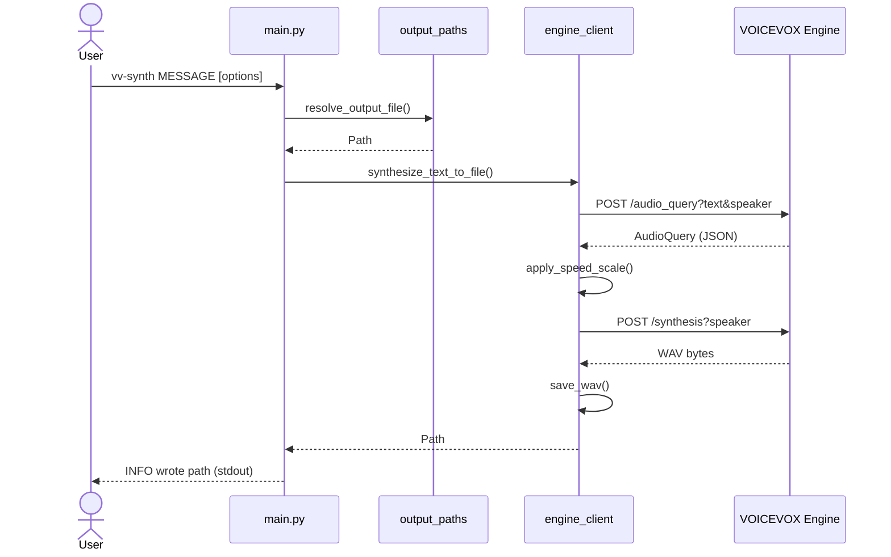
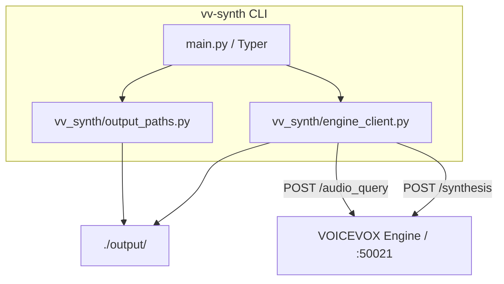

# vv-synth プロジェクト概要

`vv-synth` は、日本語テキストを [VOICEVOX Engine](https://voicevox.hiroshiba.jp/) 経由で
WAV 音声に変換する、薄い（thin）Typer 製コマンドラインツールです。本ドキュメントは、
プロジェクト全体を日本語で俯瞰するための説明資料です。利用手順の詳細は
[`README.md`](../README.md) / [`README.ja.md`](../README.ja.md)、開発・運用ルールは
[`AGENTS.md`](../AGENTS.md) を参照してください。

> **注記**
> 本ツールは VOICEVOX Engine の HTTP API を呼び出すだけのクライアントです。音声合成は
> 利用者が別途用意した Engine 側で行われます。VOICEVOX の利用規約・クレジット表記は
> 利用者の責任で確認してください（[セクション 9](#9-ライセンスと-voicevox-利用規約)）。

---

## 1. これは何か

- **目的**: 「テキスト → WAV」を 1 コマンドで実行できるようにすること。
- **位置づけ**: 音声合成そのものは行いません。合成処理はあくまで利用者が起動した
  VOICEVOX Engine（既定で `http://127.0.0.1:50021`）側で行われ、本ツールはその
  HTTP API を呼び出す**薄いクライアント**に徹します。
- **配布**: [PyPI](https://pypi.org/project/vv-synth/) で公開しています（`uv tool install vv-synth`）。
- **同梱しないもの**（リポジトリ・PyPI パッケージ共通）: VOICEVOX Engine 本体、
  音声ライブラリ、モデル、Docker イメージ、公式バイナリ、生成済み音声（WAV）。
  これらはすべて外部に置く方針です（[`.claude/rules/terms.md`](../.claude/rules/terms.md)）。

## 2. 主な機能

- VOICEVOX Engine への薄い HTTP クライアント（標準ライブラリ `urllib` のみ使用）
- 2 段階パイプライン: `POST /audio_query`（クエリ生成）→ `POST /synthesis`（合成）
- 話速（`--speed` / `speedScale`）の調整
- 話者スタイル ID（`--speaker`）の指定
- 出力先の柔軟な解決（タイムスタンプ自動命名 / ファイル名 / フルパス）
- 成功時は保存先を `INFO: wrote <絶対パス>` として stdout に出力
- 合成・ファイル入出力の失敗時は 1 行の英語エラーメッセージ（stderr、終了コード 1。トレースバックは出さない）
- 引数・オプションが不正な場合は Typer の使用方法エラー（stderr、終了コード 2）

## 3. CLI の使い方

単一コマンド構成です（サブコマンドはありません）。`vv-synth` と短縮エイリアス `vvs` が
同じ動作をします。

```shell
vv-synth MESSAGE [OPTIONS]
```

| オプション | 短縮 | 既定値 | 説明 |
|------------|------|--------|------|
| `MESSAGE` | — | 必須 | 読み上げるテキスト |
| `--output` | `-o` | 自動命名 | 出力 WAV のファイル名またはパス |
| `--output-dir` | — | `output` | WAV 保存ディレクトリ（環境変数 `VV_SYNTH_OUTPUT_DIR` 可） |
| `--speaker` | `-s` | `2` | 話者スタイル ID（Engine の `GET /speakers`） |
| `--speed` | — | `1.0` | 話速（有限の数値 `0.01`〜`10.0`。`1.0` が標準） |
| `--engine-url` | — | `http://127.0.0.1:50021` | Engine の URL（環境変数 `VOICEVOX_ENGINE_URL` 可） |

`--help` の文言は英語です（日本語の説明は README.ja.md 側に置く方針）。

## 4. 動作の流れ



HTTP タイムアウトは `/audio_query` が 60 秒、`/synthesis` が 120 秒です。

## 5. プロジェクト構成



| パス | 役割 |
|------|------|
| `main.py` | Typer CLI とエントリポイント `main:main`（CLI 層のみ、業務ロジックは持たない） |
| `vv_synth/__init__.py` | ライブラリパッケージの初期化 |
| `vv_synth/engine_client.py` | Engine への HTTP 通信・話速適用・WAV 保存と `EngineClientError` |
| `vv_synth/output_paths.py` | 出力パス解決（`output/`、`-o`、タイムスタンプ命名） |
| `tests/` | `pytest` によるユニットテスト（Engine をモックするため実 Engine 不要） |
| `skills/` | 移植用 TTS スキルと本リポジトリ開発用スキル |
| `.claude/rules/` | コミット・コーディング・アーキテクチャ等のルール |

`vv_synth/engine_client.py` の主な公開関数: `create_audio_query` /
`apply_speed_scale` / `synthesize_wav` / `save_wav` / `synthesize_text_to_file`。

## 6. 出力先の決まり方

WAV は既定でコマンド実行ディレクトリの `output/` に保存されます。

| 指定 | 保存先の例 |
|------|------------|
| `-o` 省略 | `output/20260521-143052.wav`（ローカル時刻のタイムスタンプ） |
| `-o hello.wav` | `output/hello.wav` |
| `-o path/to/a.wav` | 指定パスそのまま |
| `--output-dir artifacts` | `artifacts/...` |

## 7. 必要環境とセットアップ

- Python 3.14+
- [uv](https://docs.astral.sh/uv/)
- 起動中の VOICEVOX Engine（Docker または公式バイナリ）

```shell
# PyPI からインストール
uv tool install vv-synth

# VOICEVOX Engine を起動（Docker が最も簡単）
docker run --rm -it -p '127.0.0.1:50021:50021' voicevox/voicevox_engine:cpu-latest

# 別ターミナルで合成
vv-synth "こんにちは、音声合成のテストです。"
```

インストールせずに試す場合は `uvx vv-synth "..."` を使います。開発時はリポジトリをクローンして
`uv sync` し、`uv run vv-synth` で実行します（[8. 開発フロー](#8-開発フロー)）。

## 8. 開発フロー

```shell
uv sync --group dev
uv run ruff check .
uv run ruff format .
uv run ty check
uv run pytest
```

- 言語/型: Python 3.14、型ヒント必須、`--help` は英語
- Lint: ruff（`select = ["ALL"]`、strict）、型チェック: ty（strict）
- 絶対インポートのみ（相対インポート禁止）
- コミット: 英語ワンライン `prefix: message`（`feat` / `fix` / `docs` など）。コミットは依頼時のみ。
- リリース: 同じバージョンを PyPI と GitHub Release（タグ `v<version>`）に公開します。手順は
  [README の Release](../README.md#release) を参照。公開は依頼時のみ。

## 9. ライセンスと VOICEVOX 利用規約

- 本リポジトリのコードは [MIT License](../LICENSE)（© 2026 ru-461）です。
- **生成された音声は MIT の対象外**で、最新の公式 VOICEVOX 利用規約および各音声
  ライブラリ／話者ごとの規約（クレジット表記を含む）に従います。
- 音声を共有・再配布する前に、必要な VOICEVOX クレジットと適用規約を必ず確認して
  ください。
- 参考: [VOICEVOX 公式利用規約](https://voicevox.hiroshiba.jp/term/)

## 10. 関連ドキュメント

- [`README.md`](../README.md) / [`README.ja.md`](../README.ja.md) — 利用者向け説明
- [`AGENTS.md`](../AGENTS.md) / [`CLAUDE.md`](../CLAUDE.md) — エージェント／開発者向けガイド
- [`CONTRIBUTING.md`](../CONTRIBUTING.md) — 貢献方法
- [`.github/CODE_OF_CONDUCT.md`](../.github/CODE_OF_CONDUCT.md) — 行動規範
- [`SECURITY.md`](../SECURITY.md) — セキュリティ方針
- [`.claude/rules/`](../.claude/rules/) — 詳細ルール集
